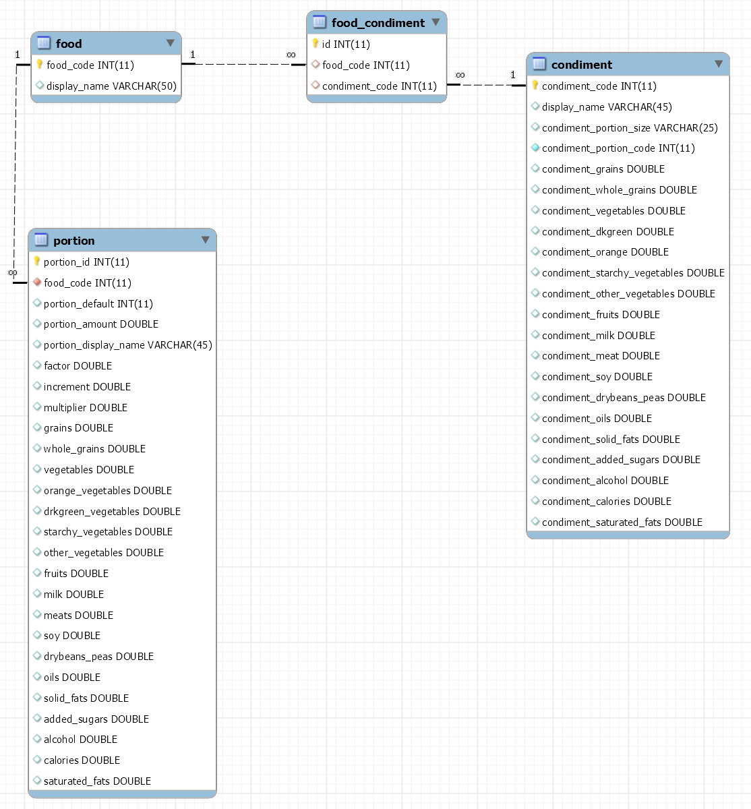

# Descrizione

Il data-set `food_pyramid_mod` riporta le qualità nutrizionali di una serie di cibi ed ingredienti.

Il data-set (estratto dal sito <https://catalog.data.gov/dataset/mypyramid-food-raw-data-f9ed6>) contiene una tabella `food` con vari tipi di cibi. Ciascun cibo può essere servito in porzioni di dimensione diversa (descritte nella tabella `portion`), e ciascun cibo può includere zero o più ingredienti tra quelli riportati nella tabella `condiment`. Gli ingredienti inclusi in ciascun cibo son descritti dalla relazione `food_condiment`. Si noti che alcuni cibi particolarmente semplici (ad esempio: Whole milk, food_code 11111000) possono comparire sia come cibo, che come ingrediente.

